# 📚 Anchor Orderbook

A decentralized order book implementation built with the Anchor framework on Solana. This smart contract enables users to create, match, and cancel token trading orders in a fully trustless and decentralized manner.


## ✨ Features

- **✅ Place Orders**: Create buy or sell orders for SPL tokens with custom pricing
- **❌ Order Cancellation**: Cancel pending orders and retrieve escrowed tokens
- **🏦 Secure Vault System**: Token custody through Program Derived Addresses (PDAs)

## 📋 Order Types

| Type | Description |
|------|-------------|
| **Buy** | Purchase tokens at or below a specified price |
| **Sell** | Sell tokens at or above a specified price |

## 🏗️ Project Structure

```
anchor-orderbook/
├── 📁 programs/
│   └── anchor-orderbook/
│       ├── Cargo.toml
│       ├── Xargo.toml
│       └── src/
│           ├── lib.rs                 # Main program entry point
│           ├── constants.rs           # Program constants and configurations
│           ├── instructions/          # Business logic handlers
│           │   ├── mod.rs            # Module exports
│           │   ├── place_order.rs    # Order creation logic
│           │   ├── resolve_order.rs  # Order matching and execution
│           │   └── cancel_order.rs   # Order cancellation logic
│           └── state/
│               ├── mod.rs
│               └── order.rs          # Order struct and enums
├── 📁 tests/                         # Integration tests
│   └── anchor-orderbook.ts

├── 📁 app/
├── 📄 Anchor.toml
├── 📄 Cargo.toml
├── 📄 package.json
└── 📄 tsconfig.json
```

## 🏗️ Program Architecture

#### 🏗️ Architecture Diagram


### 🎯 Instruction Overview

| Instruction | Purpose | Caller | Key Operations |
|-------------|---------|--------|----------------|
| **`place_order`** | Create new buy/sell order | User | • Initialize Order PDA<br>• Transfer tokens to vault<br>• Set order parameters |
| **`resolve_order`** | Match & execute orders | Off-chain matcher | • Transfer tokens between parties<br>• Update order fill amounts<br>• Handle partial fills |
| **`cancel_order`** | Cancel pending order | Order creator | • Return escrowed tokens<br>• Close Order PDA<br>• Reclaim rent |

### 🏛️ Account Architecture

#### Order Account (PDA)
```rust
pub struct Order {
    creator: Pubkey,              // Order creator's wallet
    listed_token_mint: Pubkey,    // Token being traded
    listed_token_amount: u64,     // Total order size
    listed_token_price: u64,      // Price per token
    accepting_token_mint: Pubkey, // Payment token
    filled_amount: u64,           // Amount filled so far
    order_type: OrderType,        // Buy or Sell
    order_status: OrderStatus,    // Open/PartiallyFilled/Filled
    seed: u8,                     // Unique identifier
    bump: u8,                     // PDA bump seed
}
```

**PDA Derivation**: `[b"order", creator, listed_token_mint, seed]`

#### Token Vault (ATA)
- **Owner**: Order PDA
- **Purpose**: Escrow user tokens during order lifetime
- **Security**: Only accessible via program instructions with proper authorization

### 🔄 Order Lifecycle


### 🔐 Security Model

#### Program Derived Addresses (PDAs)

#### Token Custody
- **Escrow System**: User tokens held in vault ATAs owned by Order PDAs
- **Authorization**: Vault access controlled by PDA signatures

#### Access Control
- **Order Creation**: Only order creator can cancel their orders
- **Order Matching**: Any authorized matcher can resolve compatible orders
- **Token Recovery**: Escrowed tokens returned to original owner on cancellation

### 🎮 Order Matching Logic [TODO]

The program supports **off-chain order matching** with **on-chain settlement**:

1. **Off-chain Matcher** discovers compatible orders
2. **Price Compatibility** verified (buy price ≥ sell price)
3. **Token Pair Matching** ensured (buyer's accepting = seller's listed)

#### Example Trade Flow
```
Seller: SELL 100 SOL at 50 USDC each
Buyer:  BUY  50 SOL at 52 USDC each
Result: 50 SOL traded at 50 USDC (seller's price)
```

### 🚀 Scalability Features

- **Multiple Orders**: Users can create multiple orders with different seeds
- **Partial Fills**: Orders can be filled incrementally over multiple transactions
- **Gas Efficiency**: Minimal computational overhead per transaction

### Prerequisites

- [Rust](https://rustup.rs/) (latest stable version)
- [Solana CLI](https://docs.solana.com/cli/install-solana-cli-tools) (v1.16.0+)
- [Anchor CLI](https://www.anchor-lang.com/docs/installation) (v0.31.1+)
- [Node.js](https://nodejs.org/) (v18+)
- [Yarn](https://yarnpkg.com/) package manager

### Installation

1. **Clone the repository**
   ```bash
   git clone https://github.com/Mahhheshh/anchor-orderbook
   cd anchor-orderbook
   ```

2. **Install dependencies**
   ```bash
   yarn install
   ```

3. **Build the program**
   ```bash
   anchor build
   ```

4. **Run tests**
   ```bash
   anchor test
   ```

## 📝 License

This project is licensed under the [MIT License](LICENSE).

## ⚠️ Disclaimer

This is a demonstration project for educational purposes. It has not been audited and should not be used in production environments without proper security review and testing.